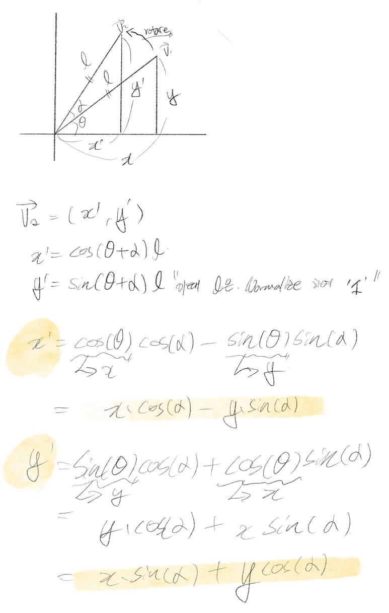

# Cub3d

Date: 2021/03/18
Language: C

## 오늘 한 일

---

1. mini_map 상의 플레이어의 위치 나타내기
    - 플레이어의 초기 위치를 `int` 값 그대로 적용시 타일의 가장자리에 위치 → 초기값 + 위치보정
2. Key press에 따른 움직임 구현
    - 플레이어의 위치 = 초기 위치 + 방향 벡터 * 속력
    - 플레이어의 회전 구현

    

3. 1개의 Raycasting 사용해보기
    - DDA 알고리즘을 적용하여 플레이어와 오브젝트 사이의 거리 도출 및 충돌 확인

---

## 더 알아볼 것

1. 데이터 구조에 따라 발생하는 y축 반전에 대하여...

## 내일 할 일

---

1. 초기 시작시 거리 확인 불가 건 수정
2. 복수의 Raycasting 사용하여 그래픽 출력해보기

---
